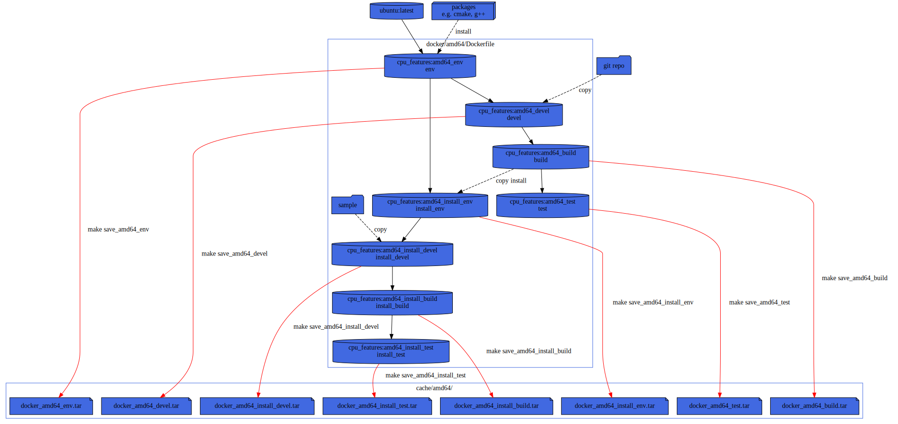

# GitHub-CI Status
| OS       | amd64 | AArch64 | ARM | MIPS |
|:-------- | :----: | :-----: | :-: | :--: |
| FreeBSD    | [![Status][freebsd_svg]][freebsd_link] | N/A | N/A | N/A |
| Linux    | [![Status][linux_svg]][linux_link] | [![Status][linux_aarch64_svg]][linux_aarch64_link] | [![Status][linux_arm_svg]][linux_arm_link] | [![Status][linux_mips_svg]][linux_mips_link] |
| MacOS    | [![Status][macos_svg]][macos_link] | N/A | N/A | N/A |
| Windows  | [![Status][windows_svg]][windows_link] | N/A | N/A | N/A |

[freebsd_svg]: https://github.com/google/cpu_features/actions/workflows/amd64_freebsd.yml/badge.svg?branch=main
[freebsd_link]: https://github.com/google/cpu_features/actions/workflows/amd64_freebsd.yml

[linux_svg]: https://github.com/google/cpu_features/actions/workflows/amd64_linux.yml/badge.svg?branch=main
[linux_link]: https://github.com/google/cpu_features/actions/workflows/amd64_linux.yml
[linux_aarch64_svg]: https://github.com/google/cpu_features/actions/workflows/aarch64_linux.yml/badge.svg?branch=main
[linux_aarch64_link]: https://github.com/google/cpu_features/actions/workflows/aarch64_linux.yml
[linux_arm_svg]: https://github.com/google/cpu_features/actions/workflows/arm_linux.yml/badge.svg?branch=main
[linux_arm_link]: https://github.com/google/cpu_features/actions/workflows/arm_linux.yml
[linux_mips_svg]: https://github.com/google/cpu_features/actions/workflows/mips_linux.yml/badge.svg?branch=main
[linux_mips_link]: https://github.com/google/cpu_features/actions/workflows/mips_linux.yml

[macos_svg]: https://github.com/google/cpu_features/actions/workflows/amd64_macos.yml/badge.svg?branch=main
[macos_link]: https://github.com/google/cpu_features/actions/workflows/amd64_macos.yml

[windows_svg]: https://github.com/google/cpu_features/actions/workflows/amd64_windows.yml/badge.svg?branch=main
[windows_link]: https://github.com/google/cpu_features/actions/workflows/amd64_windows.yml

## Makefile/Docker testing
To test the build on various distro, we are using docker containers and a Makefile for orchestration.

pros:
* You are independent of third party CI runner config
  (e.g. [github action virtual-environnments](https://github.com/actions/virtual-environments)).
* You can run it locally on your linux system.
* Most CI provide runners with docker and Makefile installed.

cons:
* Only GNU/Linux distro supported.

### Usage
To get the help simply type:
```sh
make
```

note: you can also use from top directory
```sh
make --directory=ci
```

### Example
For example to test mips32 inside an container:
```sh
make mips32_test
```

### Docker layers
Dockerfile is splitted in several stages.




## Makefile/Vagrant testing
To test build for FreeBSD we are using Vagrant and VirtualBox box.

This is similar to the docker stuff but use `vagrant` as `docker` cli and
VirtuaBox to replace the docker engine daemon.
